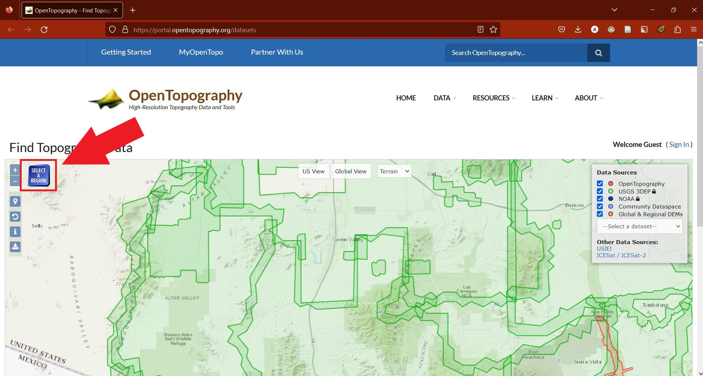
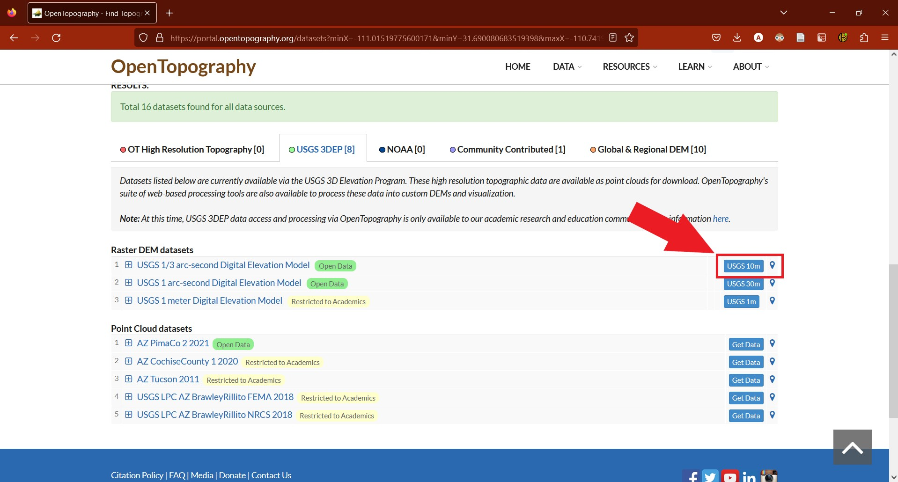
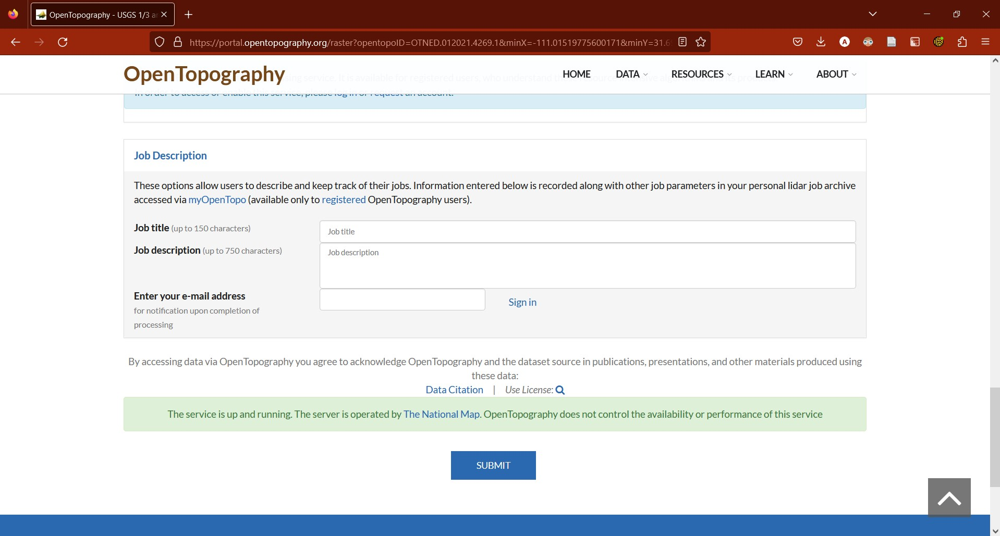

# HowToFindYourDEM

OpenTopography has digital elevations models (DEM) for most of the U.S. You can also use a DEM raster (.tif) from any source. 

[OpenTopography.org](https://portal.opentopography.org/datasets)

Zoom into your area of interest and then select the area you want to analyze using the selection tool. 

    

Then select the DEM you want to use. The 10 meter DEM from USGS is standard, but you can use any of the other options as well. Click the blue button to select the DEM.

    

Scroll down and select the ***GeoTiff*** format for the DEM. Leave the "Raster Visualization" options unchecked. Enter is your email (required). Finally, click the blue button "Submit" button to submit the job to the server. Once the job is completed, download the DEM.

    

OpenTogography.org also has a wonderful (three minute!) [Youtube tutorial here](https://youtu.be/f1m-qa-6YXo)

Please note that you do not have to exactly crop your DEM, as this project will do that for you using your boundary shapefile.
